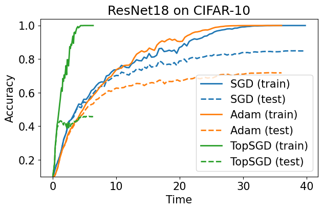

# top-sgd

Running `main.py` will regenerate `topsgd.png`.


```
$ python main.py
Files already downloaded and verified
Files already downloaded and verified
training with SGD...
100%|████████████████████████████████████████████████████| 10/10 [00:39<00:00,  3.98s/it]
train loss: 0.00276195497950539
train accuracy: 0.99998
test accuracy:  0.8421
evaluating...
100%|██████████████████████████████████████████████████| 101/101 [01:10<00:00,  1.42it/s]
training with Adam...
100%|███████████████████████████████████████████████████████| 9/9 [00:36<00:00,  4.00s/it]
train loss: 0.0058197649102658035
train accuracy: 1.0
test accuracy: 0.722
evaluating...
100%|█████████████████████████████████████████████████████| 91/91 [01:04<00:00,  1.42it/s]
training with TopSGD...
100%|████████████████████████████████████████████████████| 25/25 [00:06<00:00,  3.92it/s]
train loss: 0.0020203389273956416
train accuracy: 1.0
test accuracy: 0.4609
evaluating...
100%|████████████████████████████████████████████████████| 64/64 [00:45<00:00,  1.42it/s]
speedup (topsgd vs sgd): 6.237344506561958
saved figure
```

